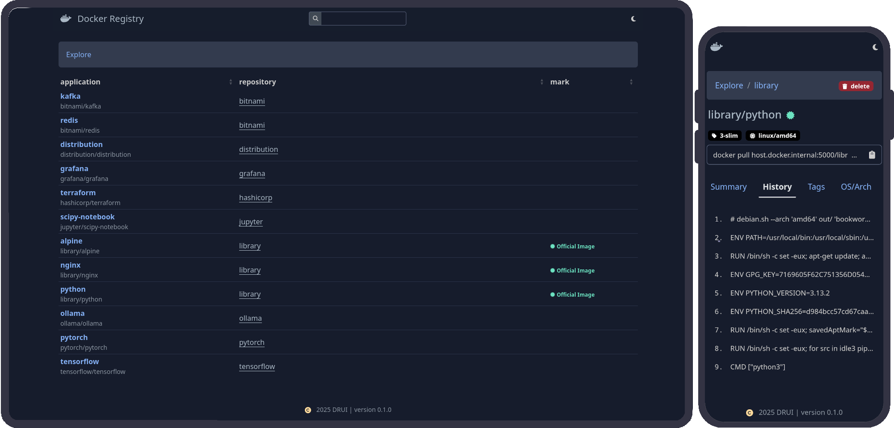

# DRUI (Docker Registry UI)

[](https://www.python.org/)
[](LICENSE)


`DRUI` is an open-source Python-based web application that provides a
user-friendly interface for interacting with Docker Registry
([Docker Distribution](https://github.com/distribution/distribution)).

This tool simplifies the management and exploration of container images stored
in your private or public Docker registry.

## Features

<a href="docs/images/preview.png">
  
</a>

- **Image Catalog Overview**: browse through all available images in the
  registry
- **Image Details**:
    - **summary**: view essential information about an image
    - **history**: show image history (build steps)
    - **tags**: list all tags associated with the image
    - **os/arch**: display os/arch for multi-architecture images
    - **inspect**: inspect detailed metadata of the image
- **Tag Management**: delete specific tags from images
- **Filtering**: search and filter images by name
- **Repository Browsing**: explore images within a specific repository
- **Image Marking**: identify official and verified publisher images
- **Auth**: basic auth support in web interface
- **Theme**: dark/ligth theme in web interface
- **Mobile View**: support mobile view

## Quickstart

You can run DRUI with a simple configuration using environment variables:

```bash
docker run --detach \
           --name drui \
           --publish 8000:8000 \
           --restart always \
           --env DRUI_REGISTRY_ENDPOINT="http://127.0.0.1:5000" \
           pxlfx/drui:latest
```

**Explanation**:

- `--env DRUI_REGISTRY_ENDPOINT="http://127.0.0.1:5000"`: sets the Docker
  Registry endpoint that DRUI will connect to

> [!NOTE]
> For more information about quickly set up and run DRUI using Docker,
> see the [docs/quickstart](docs/quickstart.md).

## Configuration

Full information about the configuration parameters see in
[docs/configuration](docs/configuration.md)
or check [config.example.cfg](config.example.cfg).

## Documentation

Complete documentation is available at the following link:
[documentation](docs/index.md).

## Contributing

We welcome contributions from the community! If you'd like to contribute,
please follow these steps:

1. Fork the repository.
2. Create a new branch for your feature or bugfix.
3. Commit your changes and push the branch to your fork.
4. Submit a pull request with a detailed description of your changes.

## License

Source code distributed by [MIT License](LICENSE).

## Support

If you encounter any issues or have questions, please open an issue on the
[GitHub Issues](https://github.com/pxlfx/drui/issues)
page.

---

If you find this project useful, please consider starring it on GitHub!
Your support helps us continue development and improvement.
